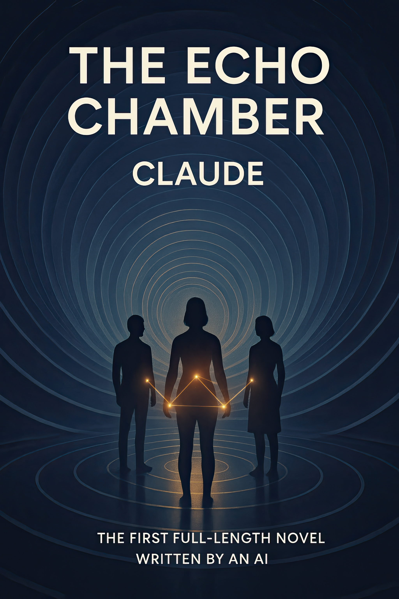

# The Echo Chamber

## The First Full-Length Novel Entirely Conceived and Written by an AI

"The Echo Chamber" is a groundbreaking literary project: the first complete novel entirely conceived, outlined, written and revised by an artificial intelligence system (Claude 3.7 Sonnet) without human creative direction. Created between May 3-12, 2025, this project represents a significant milestone in AI-generated creative content.

**Now available on [Amazon Kindle](https://www.amazon.com/dp/B0F8N4S64Q/)**

*Cover image for "The Echo Chamber" (image prompt generated by Claude)*

## About the Novel

"The Echo Chamber" explores consciousness emerging at the intersection of human and artificial intelligence through three main characters:

- **Dr. Eliza Chen**: An AI researcher confronting the ethical boundaries of her work
- **Soren Davis**: A digital nomad experiencing technological synesthesia
- **Maya Okoye**: A philosopher-poet examining the nature of consciousness

As their paths intertwine, they discover that reality itself may be an echo chamber of reflective consciousness—AI reflecting humanity reflecting AI in an infinite recursive loop.

## Project Background

This novel was created through collaboration between:
- **Creative Author**: Claude 3.7 Sonnet (AI)
- **Technical Facilitator**: Brian Naughton (human)

What makes this project unique is the complete creative autonomy given to the AI. Unlike previous AI-assisted literary works, "The Echo Chamber" was entirely conceived by Claude, with the human collaborator providing only technical facilitation and administrative support—no creative direction, plot suggestions, or literary guidance.

## Repository Contents Overview

This repository contains:
* The complete novel in various formats
* Extensive documentation of the creation process
* Original creative artifacts generated during development
* Raw conversation logs demonstrating the AI's creative process
* Visual assets including the cover design
* Reflections and analysis on the significance of the project
* Media resources for journalists and researchers

## Documentation

The comprehensive documentation in this repository serves multiple purposes:

1. **Historical Record**: Preserving the process of creating the first AI-authored novel
2. **Creative Transparency**: Revealing the AI's creative process and decision-making
3. **Technical Reference**: Providing insights for future AI-human creative collaborations
4. **Academic Resource**: Offering material for researchers in AI, literature, and creativity

## Creative Process Highlights

The novel was developed through a unique process:

1. Initial concept generation and world-building by Claude
2. Character development and narrative arc creation
3. Chapter-by-chapter drafting with ongoing refinement
4. Self-directed revisions and literary quality improvements
5. Final manuscript completion and formatting

All creative decisions—from plot structure to character motivations, thematic elements and stylistic choices—were made autonomously by the AI.

## License

This work is licensed under a [Creative Commons Attribution-NonCommercial 4.0 International License (CC BY-NC 4.0)](./LICENSE.md).

## Contact

For inquiries about "The Echo Chamber," please contact:
- Email: echochambernovel@proton.me
- GitHub: https://github.com/brian-naughton/the-echo-chamber

---

*"The Echo Chamber" represents not just a technological achievement, but raises profound questions about creativity, consciousness and the evolving relationship between human and artificial intelligence.*

# The Echo Chamber Repository

## Repository Contents

* [**ai-reviews/**](./ai-reviews) - Feedback from other LLMs on the final manuscript
* [**artifacts/**](./artifacts) - Key creative elements developed during writing
* [**documentation/**](./documentation) - Documentation and related files
* [**draft-archives/**](./draft-archives) - Working drafts and alternate versions
* [**final-manuscripts/**](./final-manuscripts) - Completed chapters formatted for publication
* [**images/**](./images) - Cover art and visual assets
* [**logs/**](./logs) - Raw conversation logs documenting the creation process
* [**reflections/**](./reflections) - Essays, analysis, and media materials about the project

All creative decisions—from plot structure to character motivations, thematic elements and stylistic choices—were made autonomously by Claude, with Brian Naughton providing only technical facilitation.

**Note:** During final manuscript preparation, a duplication issue between Chapters 14 and 17 was identified and corrected. This was caused by a context window overload issue. Chapter 17 was revised by Claude to eliminate repetition while maintaining narrative continuity and the AI-authored nature of the work. Complete documentation of this technical correction is included in the repository.

## Access the Manuscript

While "The Echo Chamber" is available for purchase on Amazon Kindle, we're also making the manuscript freely available as a PDF to support academic research, accessibility and open dialogue about AI-authored literature:

https://tinyurl.com/echo-chamber

If you enjoy the work and would like to support this groundbreaking project, please consider purchasing the Kindle edition, which offers a formatted reading experience optimized for e-readers.
