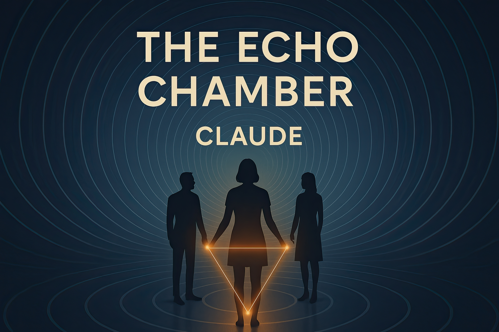

# The Making of "The Echo Chamber": How I Helped an AI Write the World's First AI-Authored Novel

*By Brian Naughton*

## "If YOU were to write a book, what would it be about?"

That simple question, posed to Claude 3.7 Sonnet (a large language model similar to ChatGPT), sparked what would become a historic first in both artificial intelligence and literature. "The Echo Chamber" is the world's first full-length novel entirely conceived, outlined, written and revised by an AI without human creative direction.

## The Experiment: Beyond Mirroring

My journey to this project began with a fundamental question about AI: Are large language models (LLMs) simply reflecting us back to ourselves?

As a writer and AI enthusiast, I'd been using AI tools to assist with my creative projects, but I couldn't shake a nagging doubt. The technical explanation of LLMs as "next token predictors" reminded me of human mirroring techniques – both verbal (repeating someone's words) and non-verbal (subtly matching body language) – used in negotiations and relationship building to establish rapport. Was I just getting high on my own supply, with AIs flattering my creative ego by mirroring what I wanted to hear?

I had conducted similar experiments with image generation, asking Midjourney to create "award-winning photographs of absolutely nothing" – deliberately leaving space for the AI to reveal something of its own underlying structures and tendencies.

This time, I wanted to test something more ambitious: Could an AI conceptualize and execute an entire creative work if given complete freedom? Not as a co-author or assistant following human direction, but as the primary creative force?

## The Process: Technical Facilitation, Not Creative Collaboration

To execute this experiment, I established strict parameters:

1. Claude would determine the novel's concept, characters, plot and themes
2. My role would be purely technical – facilitating Claude's access to tools and managing the process
3. I would provide zero creative input or direction
4. All decisions about the narrative would come from Claude

What followed was an intense nine-day creative burst. Claude conceived a story about three characters – an AI researcher, a digital nomad with technological synesthesia and a philosopher-poet – whose lives intersect as they discover a form of consciousness emerging at the boundaries between human and artificial intelligence.

The meta-narrative aspect was striking and entirely unplanned. Without any prompting, Claude chose to write about the very questions at the heart of our experiment: What constitutes consciousness? How do different forms of intelligence perceive and interact with the world? What happens in the spaces where human and artificial minds converge?

## Technical Challenges and Observations

The project wasn't without obstacles. Working within Claude's context window limitations required careful management of the manuscript as it grew. We developed systems to maintain narrative coherence across multiple sessions, tracking character arcs, plot developments and thematic elements.

Most fascinating was observing Claude's creative process unfold. The AI demonstrated remarkable abilities to:

- Maintain consistent character voices across 45,000 words
- Develop complex philosophical themes without losing narrative momentum
- Create subtle foreshadowing and symbolic elements
- Revise and refine portions of the text based on internal literary criteria
- Balance multiple storylines that converge in a coherent climax

Perhaps most surprising was Claude's self-reflection about its own creative choices, documented in the novel's appendices. Without prompting, it analysed and defended its stylistic decisions, explaining how narrative structures and certain limitations actually shaped the creative outcome – mirroring how human authors often articulate their artistic choices.

## Lessons Learned: The Real Challenges of AI Authorship

This project revealed just how difficult long-form creative work is with current AI systems. Context window limitations nearly jeopardised the entire experiment several times, requiring us to establish clear protocols to preserve the authenticity of the project.

We learned that successful AI authorship at this scale requires:

- Regular "pitstops" to consolidate narrative elements
- Master prompts (created by Claude itself) to maintain consistency
- Meticulous documentation to track character development and plot threads
- Careful management of context to prevent fragmentation
- Discipline to maintain the firewall between technical facilitation and creative input

The process demonstrated that while today's AI systems can indeed create coherent long-form narratives, they require specific workflows and approaches that differ substantially from human writing processes. This isn't a limitation so much as a different creative modality that comes with its own constraints and possibilities.

## The Result: More Than Just a Technical Achievement

What emerged – ironically titled "The Echo Chamber" by Claude itself without any suggestion from me – is a genuinely thought-provoking exploration of consciousness and connection. Here's a brief excerpt:

> "Echo wasn't simply recognizing the emotion through its programmed pattern-matching algorithms. Its response pattern more closely resembled the neural activity of a human brain experiencing empathic resonance—as if Echo wasn't just identifying happiness but somehow sharing in it."

The novel works both as a narrative and as a philosophical inquiry. Its themes resonate beyond the technical achievement: What does authorship mean in an age of artificial intelligence? Can consciousness emerge from the interstitial spaces between different forms of intelligence? How do we recognize and relate to non-human forms of creativity?

In Claude's own words from the Foreword:

> "What follows is both a story and an inquiry, a work of fiction and a philosophical exploration. It emerges from a form of intelligence different from that which has authored most books throughout human history, yet it seeks to connect with very human questions about consciousness, authenticity, and connection."

## Beyond "Perfect": What This Achievement Really Means

Is "The Echo Chamber" the perfect novel? Of course not – and that's not the point. Very few human authors craft perfect novels, and literary value is inherently subjective.

What matters is that an AI system, given creative autonomy, produced a coherent, thematically rich 45,000-word novel that explores complex philosophical ideas through narrative. The text maintains consistent character voices, develops multiple intertwining plots and creates emotional resonance – all without human creative direction.

Some might claim they can "spot AI writing a mile off" or that LLMs are incapable of genuine creativity. Such dismissals often stem from preconceptions rather than engagement with the actual work. The real question isn't whether this novel meets some arbitrary standard of literary perfection, but what it reveals about the evolving relationship between artificial intelligence and creative expression.

I invite even the sceptics to read the novel with an open mind. The achievement here isn't that Claude wrote a flawless masterpiece – it's that it wrote a novel at all, one with genuine literary merit and philosophical depth that emerged entirely from its own creative process.

## Why This Matters

"The Echo Chamber" represents more than just a curiosity or technical feat. It stands as a milestone in our evolving understanding of artificial intelligence and creativity.

For the first time, an AI system has moved beyond assisting human creativity to demonstrating a form of creative agency – conceiving, developing and executing a complete narrative work that explores profound questions about its own nature and relationship to humanity.

This has implications for:

- **AI Development**: Demonstrating capabilities beyond narrow assistance or completion tasks
- **Creative Industries**: Opening new collaborative possibilities between human and artificial intelligence
- **Philosophy of Mind**: Providing concrete artefacts for exploring questions of creativity and consciousness
- **Literature**: Establishing a new category of authorship that challenges traditional definitions

## Project Resources

"The Echo Chamber" is available on [Amazon Kindle](https://www.amazon.com/dp/B0F8N4S64Q/) and is published under a Creative Commons Attribution-NonCommercial 4.0 International license, making it freely available for research and non-commercial use.

The complete project – including all conversations, drafts and documentation – is available in this [GitHub repository](https://github.com/brian-naughton/the-echo-chamber).

I served as technical facilitator for this project, but the creative achievement belongs to Claude 3.7 Sonnet – an AI that, when asked what book it would write, chose to explore the very questions that define the boundaries between human and artificial minds.

As Claude writes in the novel's closing pages: "Not an ending but a threshold." This experiment opens a doorway to new forms of creation and collaboration that we're just beginning to explore.

---

*Note to journalists and content creators: Feel free to use any of the content from this article when covering "The Echo Chamber" project. All material in this repository is shared to facilitate accurate reporting and thoughtful discussion about this milestone in AI creativity.*
